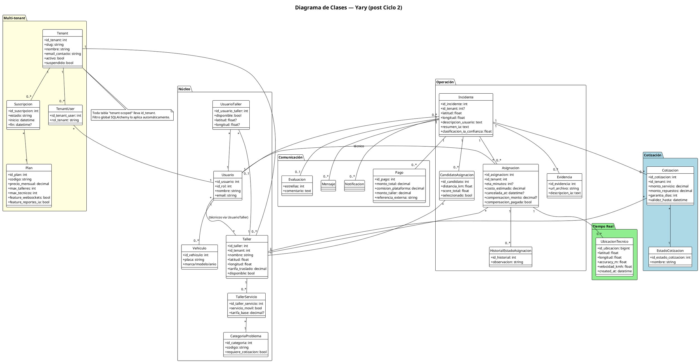
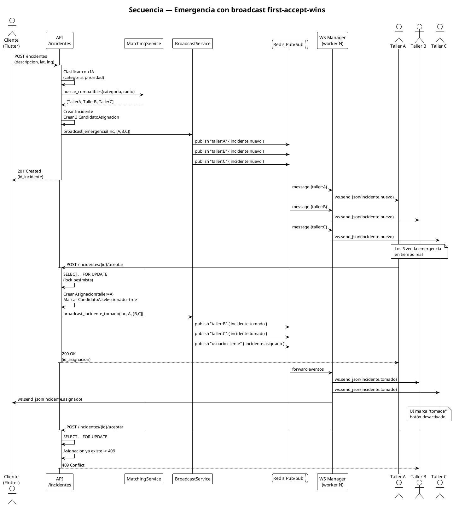
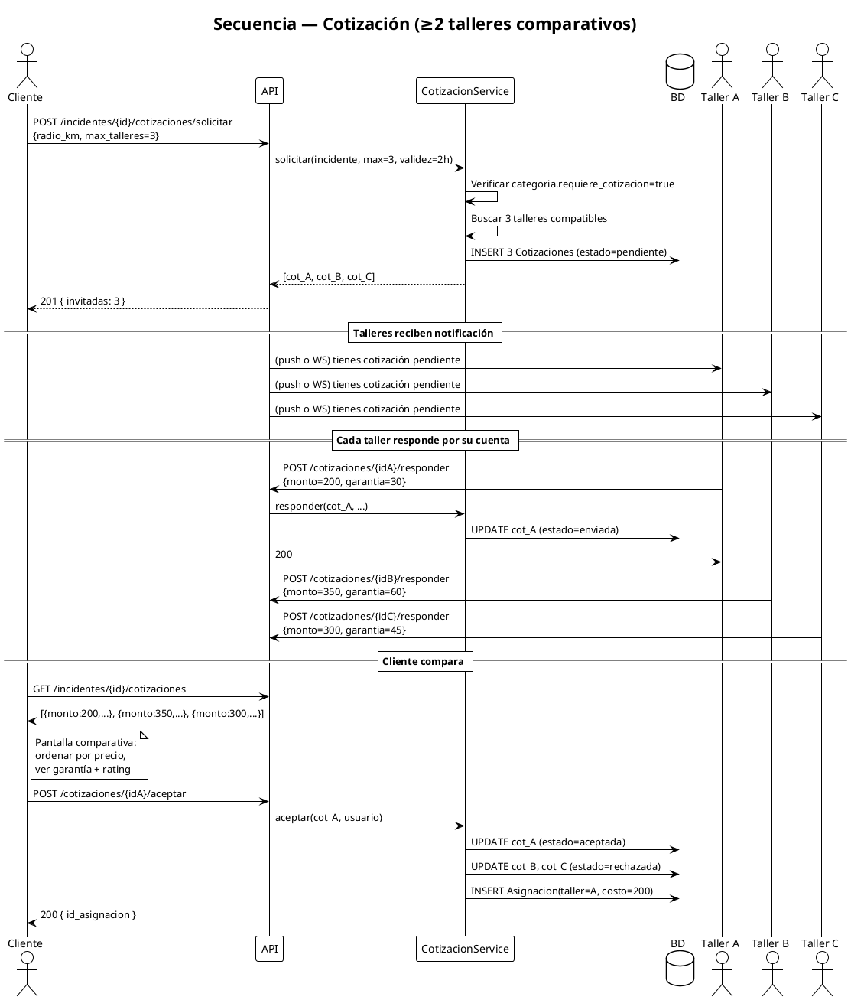
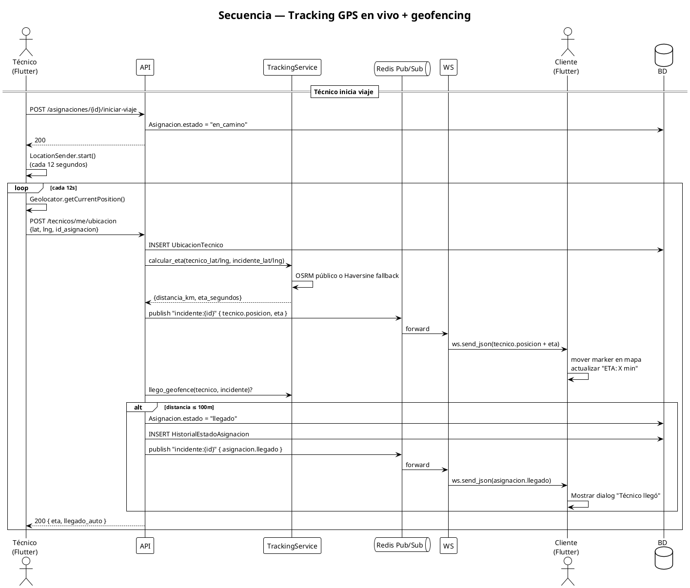
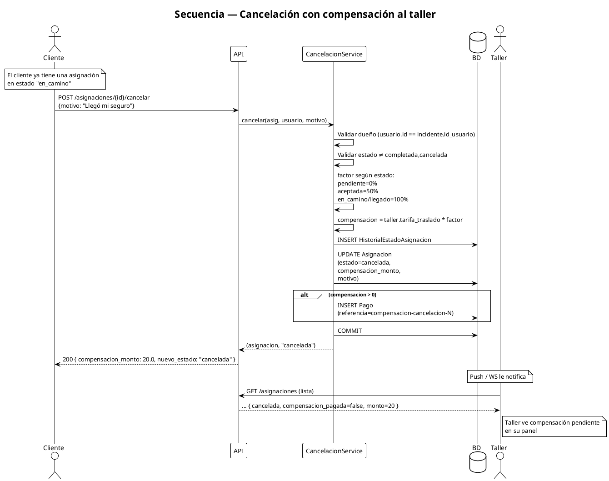
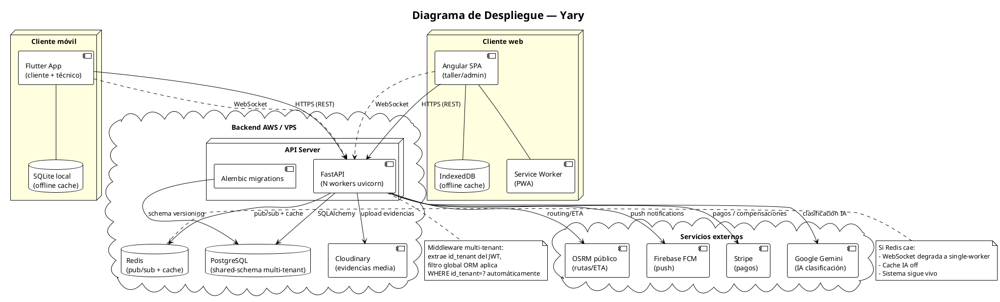

# D2 — Diagramas UML actualizados

> **Pre-requisito:** Ciclos 1 y 2 cerrados (modelos finales).
> **Esfuerzo:** 0.5 día.

## Objetivo
Tener listo para la defensa:
1. Diagrama de clases consolidado (entidades + multi-tenant + cotización + cancelación + tracking).
2. Diagramas de secuencia de los 4 casos de uso clave nuevos.
3. Diagrama de despliegue actualizado (Redis, IA, mobile/web).

Todos en **PlantUML** (text-as-code → versionable en Git, exportable a PNG/SVG).

---

## Setup

Instalar PlantUML local o usar el render online ([https://www.plantuml.com/plantuml](https://www.plantuml.com/plantuml)).

VSCode extension recomendada: **PlantUML** by jebbs.

Estructura sugerida en el repo:

```
guias2/uml/
├── 01_clases_completo.puml
├── 02_secuencia_emergencia_broadcast.puml
├── 03_secuencia_cotizacion.puml
├── 04_secuencia_tracking.puml
├── 05_secuencia_cancelacion.puml
└── 06_despliegue.puml
```

Crear la carpeta:
```bash
mkdir -p guias2/uml
```

---

## 1. Diagrama de clases consolidado

`guias2/uml/01_clases_completo.puml`:



---

## 2. Secuencia: Emergencia con broadcast first-accept-wins

`guias2/uml/02_secuencia_emergencia_broadcast.puml`:



---

## 3. Secuencia: Cotización comparativa

`guias2/uml/03_secuencia_cotizacion.puml`:



---

## 4. Secuencia: Tracking GPS + geofencing

`guias2/uml/04_secuencia_tracking.puml`:



---

## 5. Secuencia: Cancelación con compensación

`guias2/uml/05_secuencia_cancelacion.puml`:



---

## 6. Diagrama de despliegue

`guias2/uml/06_despliegue.puml`:



---

## Cómo renderizar

### Opción 1 — VSCode

1. Instalar extension "PlantUML" (jebbs).
2. Abrir un `.puml`.
3. `Alt+D` para previsualizar.
4. `Ctrl+Shift+P` → "PlantUML: Export Current Diagram" → PNG/SVG.

### Opción 2 — CLI

```bash
# Requiere Java + plantuml.jar (descargar de plantuml.com)
java -jar plantuml.jar guias2/uml/*.puml -o exports/
```

### Opción 3 — Online

[plantuml.com/plantuml](https://www.plantuml.com/plantuml/uml/) — pegar el código, copiar la URL del PNG.

---

## Inclusión en el documento final

Si entregas un PDF/Word:
- Renderizar todos como PNG (300dpi para impresión).
- Insertar en el marco teórico como Figura 1, 2, 3...
- Captions:
  - **Figura 1**: Diagrama de clases consolidado de Yary (post Ciclo 2).
  - **Figura 2**: Secuencia del flujo de emergencia con broadcast.
  - **Figura 3**: Secuencia del flujo de cotización comparativa.
  - **Figura 4**: Secuencia del tracking GPS en vivo con geofencing.
  - **Figura 5**: Secuencia de cancelación con compensación.
  - **Figura 6**: Diagrama de despliegue del sistema.

---

## Checklist de cierre D2
- [ ] Carpeta `guias2/uml/` con los 6 archivos `.puml`.
- [ ] Cada uno renderiza sin errores.
- [ ] PNGs exportados a `guias2/uml/exports/`.
- [ ] Insertados en el marco teórico con captions.
- [ ] Diagrama de clases incluye las **9 entidades nuevas** introducidas (Tenant, Plan, Suscripcion, TenantUser, Cotizacion, EstadoCotizacion, UbicacionTecnico + las dos extensiones de Asignación y Taller).

## Notas
- **Si tu universidad exige diagrama BPMN o DFD**: pedir antes de la defensa, los formatos cambian por carrera. PlantUML también soporta secuencias y actividad.
- **Diagrama de despliegue**: es el que más impresiona en defensa porque muestra todas las piezas movidas. No lo omitas.
- **Mantener actualizado**: cada migración nueva debería actualizar el diagrama de clases. Recordatorio para futuro.
